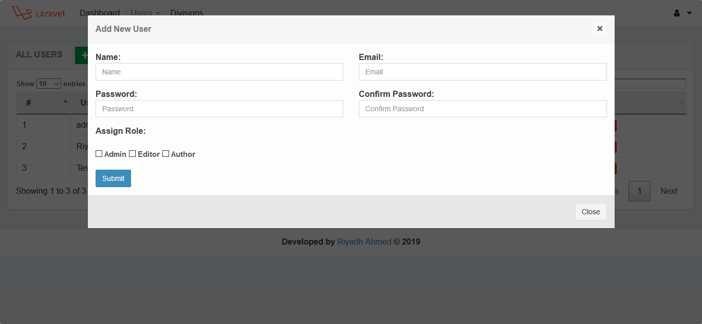
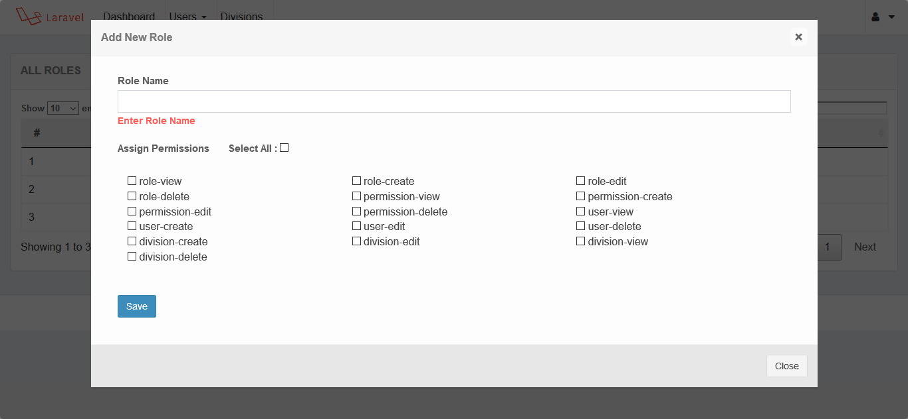
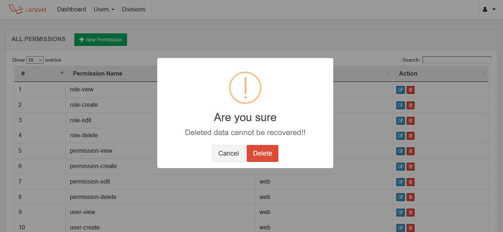

#Laravel ACL GUI using Spatie Laravel Permission and Yazra Datatable with Ajax

### Requirements

    1. PHP version upto 7.1.3    
    2. Laravel version  5.6, 5.7    

### Installation

    1. Clone the project using git clone   
    2. Go to project root folder.Open git bash or terminal and run  composer install   
    3. Copy a fresh .env file from laravel github    
    4. Update .env file by adding database information    
    5. Run php artisan key:generate in the terminal    
    6. Run php artisan migrate    
    7. Run all seeder class from seeds folder
    
### Seeder Class
    1. php artisan db:seed   to seed all seeder  or try below
    
    2. php artisan make:seeder UsersTableSeeder  for user
    3. php artisan make:seeder RolesTableSeeder  for Roles
    3. php artisan make:seeder PermissionTableSeeder  for Permissions   
    
### Troubleshootings
    
    All MOdels are in App/Models folder
    
    1. Add 'model' => App\Models\User::class, in config/auth.php providers
    2. Try composer composer dump-autoload if need
    3. php artisan config:cache if need
    4. php artisan clear-compiled if need    
    
         
### Login
         
         email : admin@admin.com
         pass :  admin123
    
Output : 

 Find me on Facebook  : [ My Facebook profile link](https://www.facebook.com/morshed.riyad) \
 Find me on  Linkedin  : [My Linkedin profile  link](https://www.linkedin.com/in/monjur-morshed-riyadh-6aaba465/)  \
 Email me : riyadhahmed777@gmail.com